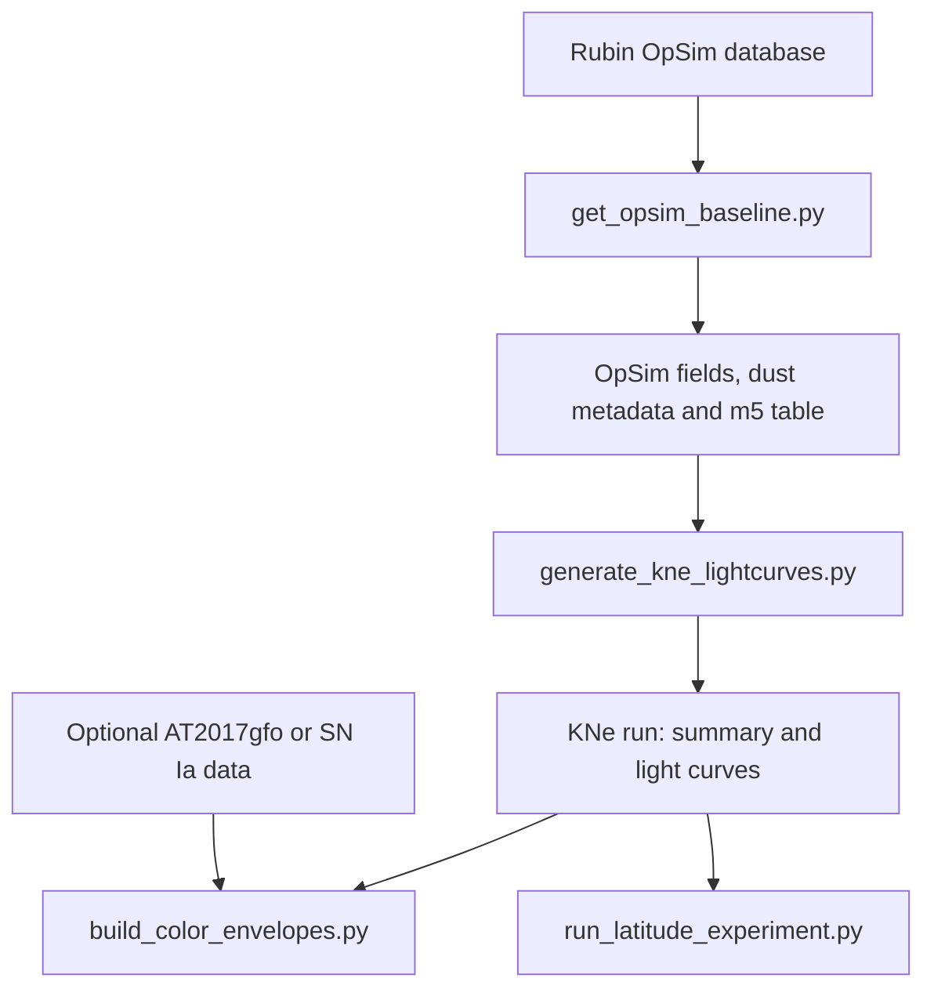

# KNe–LSST colour-envelope analysis pipeline

This repository contains a reproducible workflow to:

- export Rubin/LSST observing fields from an OpSim database;
- simulate kilonova (KNe) light curves with the FIESTA `Bu2026_MLP`
  surrogate;
- build time-dependent colour envelopes in Rubin/LSST and PS1 filters;
- separate the effects of Milky-Way extinction and Rubin limiting depth;
- optionally compare KNe envelopes with AT2017gfo or a simulated Type Ia
  supernova population;
- quantify relative colour-availability losses as a function of Galactic
  latitude.

The repository contains analysis code, tests, and documentation. Generated
runs, figures, OpSim exports, external transient samples, and FIESTA model
weights are intentionally not versioned.

> **Research-software status.** This is an analysis pipeline under active
> development, not an official Rubin Observatory product. Reproducing a
> scientific result requires the repository commit, configuration and seed
> files, external input checksums, and the software environment.

## Workflow



## Repository contents

| File | Purpose |
|---|---|
| `get_opsim_baseline.py` | Export OpSim visits, field coordinates, Galactic extinction metadata, and canonical m5 summaries. |
| `generate_kne_lightcurves.py` | Generate dense synthetic KNe curves and, when requested, LSST-like observations. |
| `build_color_envelopes.py` | Construct four-stage KNe colour envelopes and optional AT2017gfo/SN Ia comparisons. |
| `run_latitude_experiment.py` | Run the complete paired Galactic-latitude experiment. |
| `analyze_kne_latitude_losses.py` | Measure losses within one generated population. Normally called by the latitude orchestrator. |
| `compare_kne_latitude_bins.py` | Compare disjoint latitude bins and create the final relative-loss plot and PNG table. |
| `kne_pipeline_common.py` | Shared OpSim, m5, extinction, and input-discovery helpers. Not run directly. |
| `dynamic_color_cut_common.py` | Shared colour-envelope utilities. Not run directly. |
| `tools/` | Small data-inspection utilities. |
| `docs/` | Data formats, methodology, SN Ia input, publishing, and reproducibility notes. |
| `tests/` | Lightweight regression tests that do not require a full production simulation. |

## Installation

The reference environment used Python 3.12.12 and FIESTA 0.2.0.

### Conda route

```bash
git clone https://github.com/AlSag/KLLAP.git
cd KLLAP
conda env create -f environment.yml
conda activate kne_lsst_analysis
python -m unittest discover -s tests -v
```

### Python virtual environment

```bash
git clone https://github.com/AlSag/KLLAP.git
cd KLLAP
python -m venv .venv
source .venv/bin/activate
python -m pip install --upgrade pip
python -m pip install -r requirements-lock.txt
python -m unittest discover -s tests -v
```

The complete workflow additionally requires:

- a compatible FIESTA installation;
- access to the `Bu2026_MLP` surrogate assets;
- `rubin_sim` and a Rubin OpSim database;
- `pyarrow` for Parquet storage;
- optional external AT2017gfo or SN Ia data for the comparison branches.

The FIESTA model assets and the OpSim database are not redistributed here.
Record their origin and SHA-256 checksums for production analyses.

## Quick start

Every main script opens an interactive terminal menu when launched without
arguments. Command-line options are available for reproducible production
runs.

### 1. Export the OpSim sky context

Interactive use:

```bash
python get_opsim_baseline.py
```

Example non-interactive export:

```bash
python get_opsim_baseline.py \
  --selection-mode ALL_SURVEY \
  --n-fields 10000 \
  --sampling-mode UNIFORM \
  --seed 12345 \
  --m5-latitude-threshold-deg 20 \
  --outdir opsim_exports_all_survey
```

Important products include:

```text
opsim_exports_all_survey/
├── opsim_fields_index.csv
├── opsim_visits_field*.csv
├── opsim_m5_medians_by_band.csv
├── m5_depth_quantiles_by_band.csv
└── opsim_survey_summary.csv
```

`m5_depth_quantiles_by_band.csv` is derived from the exported OpSim visits. It
is a property of that OpSim sample and does not need to be copied into every
KNe run. Downstream scripts discover it through the OpSim path recorded in the
run metadata.

### 2. Generate a KNe population

Interactive use:

```bash
python generate_kne_lightcurves.py
```

Example: 10,000 broad-population KNe at a fixed luminosity distance of
150 Mpc, saved as sharded Parquet:

```bash
python generate_kne_lightcurves.py \
  --run-name LSST_10000_150Mpc \
  --parameter-source broad \
  --filter-system lsst \
  --output-mode synthetic-mjd \
  --storage-format parquet \
  --opsim-dir opsim_exports_all_survey \
  --distance-mode fixed \
  --fixed-distance-mpc 150 \
  --n-samples 10000 \
  --seed 659448934
```

The generator supports:

- broad uniform physical-parameter ranges or complete joint rows from a
  FIESTA posterior (`posterior.npz` or a compatible archive);
- Rubin/LSST, PS1, or paired LSST+PS1 synthetic photometry;
- a fixed luminosity distance or direct sampling uniformly in comoving volume;
- individual CSV files, sharded Parquet, or both;
- a reusable intrinsic catalogue for paired sky or Galactic-latitude runs.

For posterior populations, complete posterior rows are sampled so correlations
between ejecta parameters are retained. The inclination can either be kept
from the posterior or redrawn isotropically.

The principal output structure is:

```text
runs/<readable_name>_seed_<seed>/
├── summary.csv
├── run_info.txt
├── runtime_performance.json
├── parquet/
│   ├── synthetic_part_*.parquet
│   └── lsstlike_part_*.parquet       # when requested
└── csv/                              # when requested
```

`summary.csv` contains one row per injected event, including events without a
saved detected LSST-like product. It records the physical parameters,
luminosity distance, redshift, viewing angle, sky assignment, extinction, and
detection summary.

### 3. Build colour envelopes

Interactive use:

```bash
python build_color_envelopes.py
```

The run directory must be the **root of the generated run**, not its Parquet
subdirectory:

```text
correct:   --run-dir runs/LSST_10000_150Mpc_seed_659448934
incorrect: --run-dir runs/LSST_10000_150Mpc_seed_659448934/parquet
```

Example with an LSST SN Ia comparison:

```bash
python build_color_envelopes.py \
  --run-dir runs/LSST_10000_150Mpc_seed_659448934 \
  --color-pair g-r \
  --photometric-system lsst \
  --t-min 0.4 \
  --t-max 16.0 \
  --bin-width 0.4 \
  --m5-scenario best_p75 \
  --threshold-scope common_global \
  --snia-parquet data/snia_mock_6band.parquet \
  --snia-magnitude-column mag_perfect \
  --snia-input-mw-mode dereddened \
  --snia-time-reference first_observation \
  --snia-position-seed 20260929
```

For each colour pair, four stages are constructed from the same population:

| Stage | m5 selection | MW extinction in the magnitudes |
|---|---:|---:|
| `intrinsic_no_m5_no_mw` | no | no |
| `no_m5_with_mw` | no | yes |
| `m5_no_mw` | yes | no |
| `m5_with_mw` | yes | yes |

For an m5-selected colour, both band magnitudes must be brighter than their
selected Rubin thresholds. The available scenarios are `worst_p25`,
`median_p50`, and `best_p75`.

The envelope builder interpolates each requested band only inside the saved
numerical support; it never extrapolates. A colour is available only when both
bands are available. Population bounds are estimated in fixed time bins using
symmetric percentile candidates and bootstrap-stability requirements.

#### Optional AT2017gfo comparison

Use a run containing paired LSST+PS1 synthetic photometry when a direct PS1
comparison is required:

```bash
python build_color_envelopes.py \
  --run-dir runs/PS1_AT2017gfo_run_seed_12345 \
  --color-pair g-r \
  --photometric-system ps1 \
  --t-min 0.4 \
  --t-max 16.0 \
  --bin-width 0.4 \
  --m5-scenario best_p75 \
  --at2017gfo-file data/AT2017gfo_corrected.dat \
  --at2017gfo-merger-mjd 57982.52851852 \
  --at2017gfo-match-window-days 0.4 \
  --at2017gfo-ebv 0.105 \
  --at2017gfo-photometry-mode dereddened
```

AT2017gfo `grizy` measurements are PS1 photometry. Comparing them with the PS1
synthetic branch avoids presenting Rubin and PS1 filters as identical.

#### Optional SN Ia comparison

The expected long-format Parquet schema is documented in
[`docs/snia_input.md`](docs/snia_input.md). The script can use either:

- `--snia-time-reference peak`: phase relative to the SALT2 `t0` maximum;
- `--snia-time-reference first_observation`: phase relative to the first
  available observation of each SN in either requested colour band.

The latter defines an observational time origin, not a physical explosion or
collapse time. KNe–SN Ia overlap fractions must therefore be interpreted in
the explicitly chosen time coordinates.

Each SN Ia is deterministically assigned a KNe sight line so that MW
extinction and depth selections are evaluated on the KNe sky distribution.
The builder writes envelope overlays, per-bin intersection bounds, overlap
fractions, and the adapted SN Ia table.

### 4. Run the Galactic-latitude experiment

The recommended experiment uses disjoint latitude bins and one shared
intrinsic catalogue:

```bash
python run_latitude_experiment.py
```

Inspect the complete plan before a long simulation:

```bash
python run_latitude_experiment.py --dry-run
```

The default bin edges are:

```text
0, 5, 10, 15, 20, 25, 30, 40, 50, 90 degrees
```

The orchestrator:

1. creates one reusable intrinsic KNe catalogue;
2. reuses the same `event_id`, physical parameters, distance, and orientation
   in every latitude bin;
3. uses a different sky/noise seed in every bin;
4. runs the loss analysis for each generated population;
5. compares every bin with the fixed lowest-latitude reference;
6. writes one relative-loss plot and one PNG value table.

For loss component `X`, the plotted quantity is

```text
R_X(bin) = loss rate X in bin / loss rate X in the [0°, 5°[ reference bin.
```

This ratio measures the relative latitude dependence of the simulated losses;
it is not an absolute astrophysical event-rate prediction.

The reported plateau is operational: it is the first bin from which all later
ratios are compatible with a common level under the chosen relative tolerance.
A low bootstrap detection fraction means that the simulation does not identify
a statistically robust threshold. See
[`docs/methodology.md`](docs/methodology.md) before assigning a physical
interpretation to it.

## Population statistics and weighting

Population envelope percentiles and loss rates are unweighted. When luminosity
distance is drawn uniformly in comoving volume, that distribution is already
the generator's sampling measure; no downstream `dV_c/dd_L`, event,
inverse-variance, or posterior weight is applied.

Inverse-variance weighting, where present, is confined to measurements within
one light curve and is not a population weight. OpSim field stratification
controls which fields are exported; it does not assign statistical weights to
downstream KNe events.

## Data conventions

- magnitudes are AB magnitudes;
- luminosity distances are in Mpc;
- times are in observer-frame days unless stated otherwise;
- KNe phases are relative to merger time;
- FIESTA receives the event redshift and returns observer-frame evolution;
- synthetic long-form tables contain one row per time and band;
- `event_id` identifies the physical event across paired products;
- saved synthetic `mag` values follow the compact MW-extincted convention;
- no interpolation is performed outside the saved numerical support.

See [`docs/data_formats.md`](docs/data_formats.md) for the expected files and
columns.

## Reproducing a published analysis

For every production result, archive:

1. the exact Git commit or release tag;
2. `environment.yml` plus an explicit package snapshot;
3. the FIESTA version and the origin/checksum of `Bu2026_MLP` assets;
4. the Rubin OpSim database version and OpSim export metadata;
5. intrinsic, sky/noise, bootstrap, and plotting seeds;
6. each run's `summary.csv`, `run_info.txt`, and configuration JSON files;
7. checksums for external AT2017gfo or SN Ia datasets;
8. the final numerical CSV tables underlying every published figure.

Run the lightweight regression suite before production:

```bash
python -m unittest discover -s tests -v
```

These tests do not replace an end-to-end validation with the actual FIESTA
surrogate, OpSim database, and external datasets.

## Scientific limitations

- Results depend on the KNe surrogate, priors, distance distribution, filter
  system, cadence/depth model, dust map, time window, binning, and bootstrap
  criteria.
- A Galactic-latitude plateau is an operational property of the selected
  experiment, not a universal Galactic constant.
- SN Ia and KNe time origins are not physically equivalent. Any overlap is a
  comparison in the declared observational coordinates.
- The supplied SN Ia mock is not redistributed and may use a simplified
  cadence. Its provenance and checksum must accompany published comparisons.
- FIESTA model weights and Rubin OpSim databases are external dependencies and
  are not covered by this repository's redistribution.

## Documentation

- [`docs/methodology.md`](docs/methodology.md): envelope and latitude-loss definitions;
- [`docs/data_formats.md`](docs/data_formats.md): generated inputs and outputs;
- [`docs/snia_input.md`](docs/snia_input.md): optional SN Ia input schema;
- [`docs/reproducibility.md`](docs/reproducibility.md): production checklist;
- [`docs/publishing.md`](docs/publishing.md): release and archival guidance;
- [`REPOSITORY_AUDIT.md`](REPOSITORY_AUDIT.md): retained and superseded scripts.

## Provenance, citation, and license

`generate_kne_lightcurves.py` was developed from the MIT-licensed FIESTA
example [`examples/generate_lightcurves.py`](https://github.com/nuclear-multimessenger-astronomy/fiestaEM/blob/7bec6b39392a47f6e937f8f7a237b8742bc334ae/examples/generate_lightcurves.py)
and was substantially extended for OpSim sky contexts, extinction, paired
populations, storage, and analysis metadata.

Upstream licensing and the requested FIESTA scientific citation are recorded
in [`THIRD_PARTY_NOTICES.md`](THIRD_PARTY_NOTICES.md). Citation metadata for
this repository are provided in [`CITATION.cff`](CITATION.cff).

The analysis code in this repository is distributed under the terms in
[`LICENSE`](LICENSE). Third-party packages, model assets, databases, and input
datasets retain their own licenses and copyright.
